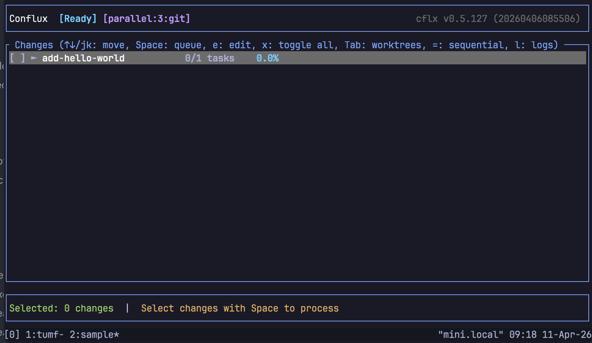
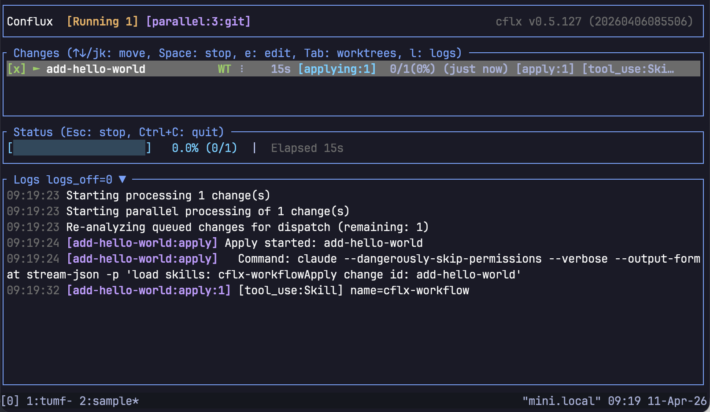
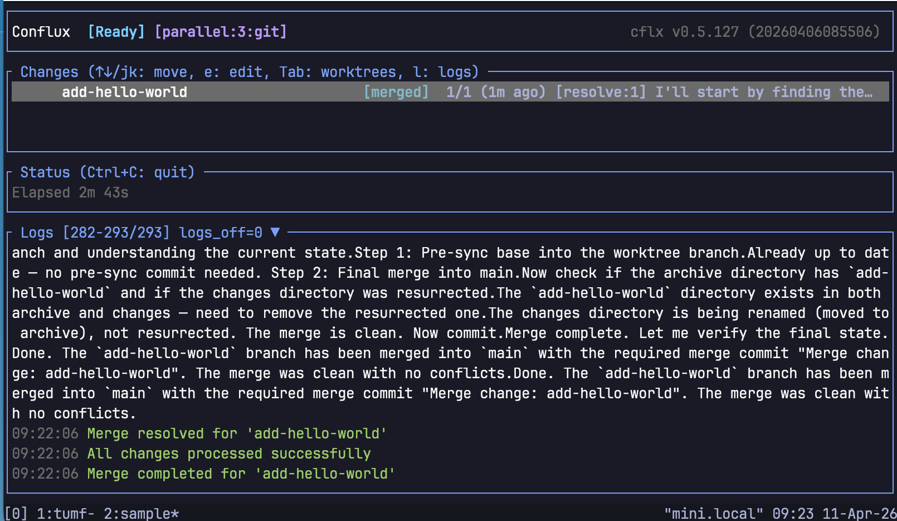

# QUICKSTART

[](./QUICKSTART.ja.md)
[](./QUICKSTART.md)
[](./QUICKSTART.zh-CN.md)
[](./QUICKSTART.es.md)
[-QUICKSTART-blue?style=flat-square)](./QUICKSTART.pt-BR.md)
[](./QUICKSTART.ko.md)
[](./QUICKSTART.fr.md)
[](./QUICKSTART.de.md)
[](./QUICKSTART.ru.md)
[](./QUICKSTART.vi.md)

Đây là hướng dẫn ngắn nhất để cài đặt `cflx` lần đầu, thiết lập dự án, tạo một change trong OpenSpec và hoàn tất việc triển khai trong TUI.

Conflux được triển khai với tên lệnh là `cflx`.

## 0. Điều kiện tiên quyết

- Có thể sử dụng Rust / Cargo: [Cài đặt Rust](https://rust-lang.org/tools/install/)
- Có thể sử dụng [Claude Code](https://claude.com/product/claude-code)
- Có một dự án được quản lý bằng git, ví dụ như `~/myproject`

> Conflux là một bộ điều phối để khởi chạy và điều khiển các AI agent. Bản thân nó không phải là coding agent.
> Nó có thể sử dụng các CLI như [Claude Code](https://claude.com/product/claude-code), [OpenCode](https://opencode.ai/) và [Codex](https://developers.openai.com/codex/cli).
> Trong QUICKSTART này, Claude Code được dùng làm ví dụ.

Kiểm tra các điều kiện tiên quyết:

```bash
cargo --version
claude --version
claude -p 'hi'
```

## 1. Cài đặt `cflx`

Cài đặt từ crates.io.

```bash
cargo install cflx
```

Kiểm tra sau khi cài đặt:

```bash
cflx --version
```

## 2. Chuẩn bị dự án

Từ đây trở đi, bạn sẽ làm việc trong thư mục dự án. Ví dụ sẽ dùng `~/myproject`.

Vì Conflux sử dụng `git worktree`, dự án bắt buộc phải được quản lý bằng git.

```bash
cd ~/myproject
```

Nếu là dự án mới:

```bash
mkdir -p ~/myproject
cd ~/myproject
git init
```

## 3. Cài đặt bundled skills

Thêm bundled skill của Conflux cho Claude Code vào dự án.

```bash
cflx install-skills --claude
```

Thao tác này sẽ đặt các skill `cflx-*` vào dưới `./.claude/skills`.

Sau đó bạn sẽ quyết định cùng với `.cflx.jsonc` xem có đưa chúng vào Git hay không.

## 4. Tạo tệp cấu hình

Tên tệp cấu hình là `.cflx.jsonc`, không phải `.cflx.conf`.

Cách nhanh nhất là tạo từ mẫu.

```bash
cflx init
```

Thao tác này sẽ tạo `.cflx.jsonc` trong thư mục hiện tại.

## 5. Kiểm tra `.cflx.jsonc`

Ở mức tối thiểu, chỉ cần có các lệnh dành cho agent mà bạn muốn sử dụng.

Ví dụ mẫu cho Claude Code:

```jsonc
{
  "analyze_command": "claude --dangerously-skip-permissions --verbose --output-format stream-json -p {prompt}",
  "apply_command": "claude --dangerously-skip-permissions --verbose --output-format stream-json -p '{prompt}'",
  "archive_command": "claude --dangerously-skip-permissions --verbose --output-format stream-json -p '{prompt}'",
  "acceptance_command": "claude --dangerously-skip-permissions --verbose --output-format stream-json -p '{prompt}'",
  "resolve_command": "claude --dangerously-skip-permissions --verbose --output-format stream-json -p {prompt}"
}
```

Ở lần đầu tiên, nội dung do `cflx init` tạo ra thường đã đủ dùng nguyên trạng.

## 6. Quyết định những gì sẽ đưa vào Git

Trong lần thiết lập đầu tiên, hãy quyết định có đưa 2 mục sau vào Git hay không:

- `./.claude/skills/cflx-*`
- `./.cflx.jsonc`

Khuyến nghị:

- Nếu bạn muốn tái tạo cùng một hành vi trong nhóm hoặc trên nhiều máy, hãy commit cả hai.
- Nếu chỉ dùng cục bộ và gần như mang tính tạm thời, hãy thêm cả hai vào `.gitignore`.

Nếu còn phân vân, commit cả hai ngay từ đầu cũng hoàn toàn ổn. Sẽ dễ quản lý hơn nếu bạn không ghi trực tiếp thông tin bí mật vào `.cflx.jsonc`.

Nếu muốn thêm cả hai vào `.gitignore`:

```bash
printf ".claude/skills/cflx-*\n.cflx.jsonc\n" >> .gitignore
git add .gitignore
git commit -m 'Ignore Conflux local setup files'
```

Nếu muốn thêm cả hai vào repository:

```bash
git add .claude/skills/cflx-* .cflx.jsonc
git commit -m 'Add Conflux setup files'
```

## 7. Tạo change proposal đầu tiên

Conflux xử lý các change của OpenSpec.

Ngay cả khi bạn chưa quen với OpenSpec cũng không sao. Bundled skills đã được cài sẵn, nên bạn có thể để Claude Code tạo proposal.

Ví dụ:

```text
/cflx-proposal python で hello world と表示する
```

Khi đó, một thư mục change như `openspec/changes/add-hello-world/` sẽ được tạo, trong đó tối thiểu có 2 tệp sau:

- `proposal.md`: sẽ thay đổi điều gì
- `tasks.md`: sẽ triển khai những gì

Với lộ trình ngắn nhất, bạn chỉ cần xem nhanh hai tệp này và nếu không có vấn đề gì thì commit luôn.

Điểm cần kiểm tra:

- Nội dung của `proposal.md` đúng với thay đổi bạn muốn thực hiện
- Các tác vụ triển khai trong `tasks.md` đầy đủ, không thiếu và không thừa
- Không lẫn các thay đổi không cần thiết

Nếu cần, hãy chỉnh sửa proposal hoặc tasks, rồi commit khi nội dung đã ổn.

```bash
git add openspec/changes/add-hello-world
git commit -m 'proposal: add-hello-world'
```

Cấu trúc chi tiết sẽ như sau:

```text
openspec
└── changes
    └── add-hello-world
        ├── proposal.md
        ├── specs
        │   └── hello-world
        │       └── spec.md
        └── tasks.md
```

## 8. Kiểm tra workspace có sạch không

Trước khi khởi động TUI, hãy kiểm tra cây làm việc có sạch hay không.

```bash
git status
```

Nếu sạch, bạn sẽ thấy kết quả tương tự như sau:

```text
On branch main
nothing to commit, working tree clean
```

## 9. Khởi động TUI

Khởi động Conflux ở chế độ TUI.

```bash
cflx
```

Màn hình như dưới đây sẽ xuất hiện.



## 10. Thực thi trong TUI

Thao tác cơ bản:

- `↑/↓` or `j/k`: chọn change
- `Space`: đánh dấu để thực thi
- `F5`: bắt đầu chạy
- `Ctrl+C`: thoát

Luồng ngắn nhất:

1. Khởi động `cflx`
2. Di chuyển đến change cần xử lý
3. Nhấn `Space` để chọn
4. Nhấn `F5` để chạy

Trong ví dụ này chỉ có một change, nên chỉ cần `Space` → `F5`.



Conflux sẽ tự động chạy vòng lặp sau:

- apply
- accept
- archive
- resolve / merge

Khi trạng thái chuyển sang `merged` là đã hoàn tất.



## 11. Kiểm tra kết quả

Xác nhận rằng phần triển khai đã được thêm vào.

```bash
tree
cat hello.py
```

Ví dụ:

```text
.
├── hello.py
└── openspec
    ├── changes
    └── specs
```

```python
print("hello world")
```

Phía OpenSpec cũng đã được cập nhật.

```bash
tree openspec -L 10
```

Ví dụ:

```text
openspec
├── changes
│   └── archive
│       └── add-hello-world
│           ├── proposal.md
│           ├── specs
│           │   └── hello-world
│           │       └── spec.md
│           └── tasks.md
└── specs
    └── hello-world
        └── spec.md
```

Bạn có thể thấy change proposal đã được lưu trữ trong archive, và đặc tả cuối cùng đã được nâng lên `openspec/specs`.

Ví dụ:

```bash
cat openspec/specs/hello-world/spec.md
```

```markdown
## Requirements

### Requirement: hello-world-output

The program must print "hello world" to standard output when executed.

#### Scenario: default-execution

**Given**: The user has Python installed
**When**: The user runs `python hello.py`
**Then**: The program prints `hello world` to stdout and exits with code 0
```

Nhờ có spec này, Conflux có thể nhanh chóng hiểu hành vi của phần mềm và tiếp tục xử lý ổn định cho các thay đổi tiếp theo.

---

Như vậy, chu trình triển khai đơn giản nhất đã hoàn tất.

QUICKSTART này chỉ dừng ở mức hoàn thành lần chạy đầu tiên theo con đường ngắn nhất.
Trong vận hành thực tế, bạn có thể sẽ cần thêm các kỹ thuật chi tiết hơn như tinh chỉnh proposal, điều chỉnh cấu hình, chạy song song hoặc xử lý sự cố.
Hãy tham khảo README hoặc `cflx --help` để biết thêm.

Nếu có ý kiến hoặc câu hỏi, hãy dùng [GitHub Issue](https://github.com/tumf/conflux/issues) hoặc mention `@tumf` trên X.
