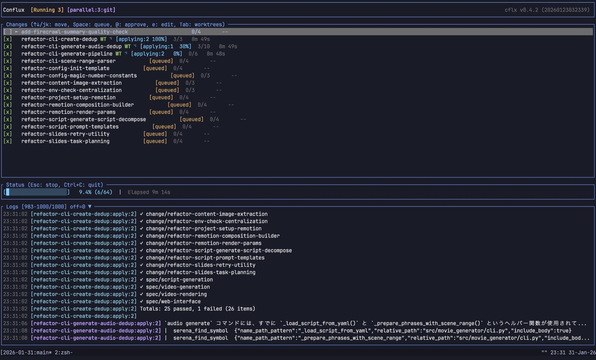

# Conflux

[](./README.ja.md) [](./README.md) [](./README.zh-CN.md) [](./README.es.md) [-informational?style=flat-square)](./README.pt-BR.md) [](./README.ko.md) [](./README.fr.md) [](./README.de.md) [](./README.ru.md) [](./README.vi.md)

[](https://www.rust-lang.org/)
[](LICENSE)



Conflux — это инструмент, оркестрирующий автономную разработку с участием AI-агентов для программирования на основе спецификационно-ориентированного подхода. Даже без постоянного участия человека он непрерывно продвигает изменения, объединяя применение, приёмочное решение, архивирование и финальное слияние в единый рабочий процесс.

Его цель — не разовая генерация кода. Сначала задаются спецификации, а затем на их основе последовательно наращиваются изменения, чтобы непрерывно развивать продукт определённого масштаба, рассчитанный на реальную эксплуатацию.

Кроме того, Conflux не зависит от конкретного поставщика ИИ. Он спроектирован так, чтобы можно было взаимозаменяемо использовать такие решения, как [Claude Code](https://docs.anthropic.com/en/docs/claude-code), [Codex](https://openai.com/index/openai-codex/) и [OpenCode](https://opencode.ai/).

## Базовые концепции Conflux

- **Автономная разработка, которая движется вперёд, пока вы спите**: даже без постоянного человеческого участия AI-агенты последовательно обрабатывают изменения и продвигают разработку.
- **Спецификационно-ориентированная разработка**: с помощью [OpenSpec](https://github.com/openspec/openspec) сначала определяются спецификации, а затем в соответствии с ними ведутся реализация, приёмка и улучшения.
- **Непрерывное развитие продукта определённого масштаба**: вместо разовой генерации изменения накапливаются шаг за шагом, приближая систему к завершённому продукту.

## Механизмы, которые это обеспечивают

- **Многоуровневые циклы Ralph**: улучшения выполняются итеративно, при этом объём контекста, передаваемого между итерациями, сводится к минимуму для более эффективного использования LLM.
- **Параллельная разработка с `git worktree`**: Conflux выделяет отдельный worktree для каждого change, что позволяет безопасно вести несколько изменений параллельно.
- **Свободный выбор агентов без привязки к вендору**: без фиксации на одном поставщике можно заменять агентов реализации и оценки в зависимости от задачи, используя [Claude Code](https://docs.anthropic.com/en/docs/claude-code), [Codex](https://openai.com/index/openai-codex/), [OpenCode](https://opencode.ai/) и другие инструменты.
- **Разделение ролей реализации и приёмки**: разделяя роль, продвигающую реализацию, и роль, проверяющую результат, можно сочетать быстрых кодеров с более сильными ревьюерами. Это позволяет эффективнее использовать LLM и одновременно ускорять весь процесс разработки.

Иными словами, Conflux — это **оркестратор, предназначенный для непрерывного продвижения продукта определённого масштаба за счёт спецификационно-ориентированной автономной разработки, организованной как реалистичный процесс с параллельным выполнением и разделением ролей**.

## Основные способы использования

| Использование | Команда |
|------|---------|
| TUI | `cflx` |
| Безголовый запуск | `cflx run` |

О серверном режиме, удалённом TUI, REST API и `cflx service` см. [руководство по серверному режиму (английская версия)](docs/guides/SERVER.md).

## Быстрый старт

Первоначальную настройку см. в [QUICKSTART.ru.md](QUICKSTART.ru.md).

## Основные команды

```bash
# TUI
cflx

# Безголовый запуск
cflx run

# Запустить только конкретное изменение
cflx run --change add-feature-x

# Инициализировать файл конфигурации
cflx init

# Установить bundled skills
cflx install-skills
```

## Конфигурация

Файл конфигурации использует формат JSONC.

- `.cflx.jsonc`
- `~/.config/cflx/config.jsonc`
- `--config <PATH>`

Генерация шаблонов:

```bash
cflx init
cflx init --template opencode
cflx init --template codex
cflx init --force
```

Более подробные примеры конфигурации, а также описание hooks, выполнения в workspace и очереди команд см. в английском README.

## Установка

```bash
cargo install cflx
```

## Документация

| Документ | Описание |
|----------|-------------|
| [QUICKSTART.ru.md](QUICKSTART.ru.md) | Первоначальная настройка |
| [Руководство по серверному режиму (английская версия)](docs/guides/SERVER.md) | Серверный режим, удалённый TUI, Web UI, REST API, фоновый сервис |
| [README.md](README.md) | Полная документация (английский) |
| [docs/guides/USAGE.md](docs/guides/USAGE.md) | Примеры использования |
| [CONTRIBUTING.md](CONTRIBUTING.md) | Руководство по внесению вклада |
| [docs/guides/DEVELOPMENT.md](docs/guides/DEVELOPMENT.md) | Руководство по разработке |
| [docs/guides/RELEASE.md](docs/guides/RELEASE.md) | Руководство по выпуску релизов |
| [docs/openapi.yaml](docs/openapi.yaml) | Спецификация API |

## Лицензия

MIT
